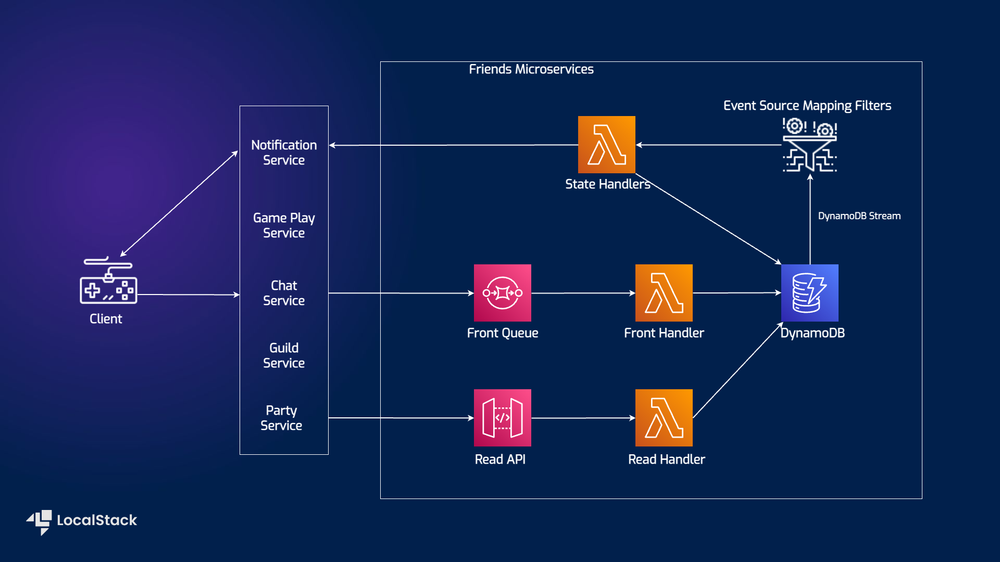

# Serverless Microservices with Amazon API Gateway, DynamoDB, SQS, and Lambda

| Key          | Value                                                                                                |
| ------------ | ---------------------------------------------------------------------------------------------------- |
| Environment  |                                                                                    |
| Services     | API Gateway, DynamoDB, SQS, Lambda                                                                   |
| Integrations | CDK                                                                                                  |
| Categories   | Serverless; Microservices                                                                            |
| Level        | Beginner                                                                                             |
| GitHub       | [Repository link](https://github.com/localstack/microservices-apigateway-lambda-dynamodb-sqs-sample) |

## Introduction

The Serverless microservices application sample demonstrates how you can build and deploy a solution for friend microservices in gaming applications using API Gateway, Lambda, DynamoDB, and SQS. This application sample allows you to handle friend state management asynchronously and utilizes DynamoDB Streams with Event Source Mapping Filters to reduce the number of transactional writes. With an SQS queue, multiple backend services can send friend actions and handle duplicated messages using Event Source Mapping Filters. An API Gateway and a Lambda Function have been implemented to read the data and DynamoDB for data persistence. The sample is decoupled from player management and only serves friend state management. Users can deploy the infrastructure with AWS Cloud Development Kit, and we will demonstrate how you use LocalStack to deploy the infrastructure on your developer machine and your CI environment.

## Architecture diagram



We are using the following AWS services and their features to build our infrastructure:

- [Lambda](https://docs.localstack.cloud/user-guide/aws/lambda/) to create the serverless functions for the Create, State, and Read handlers.
- [SQS](https://docs.localstack.cloud/user-guide/aws/sqs/) as a distributed message queuing service to intakes all friend actions from game backend services.
- [DynamoDB](https://docs.localstack.cloud/user-guide/aws/dynamodb/) as a key-value and document database to persist data with Event Source Mapping Filters to reduce number of transactional writes.
- [API Gateway](https://docs.localstack.cloud/user-guide/aws/apigatewayv2/) to expose and allow the Lambda functions to read data through HTTP APIs.

## Prerequisites

- LocalStack Pro
- [AWS CLI](https://docs.localstack.cloud/user-guide/integrations/aws-cli/) with the [`awslocal`](https://github.com/localstack/awscli-local) wrapper.
- [CDK](https://docs.localstack.cloud/user-guide/integrations/aws-cdk/) with the [`cdklocal`](https://github.com/localstack/aws-cdk-local) wrapper.
- [NodeJS v18.0.0](https://nodejs.org/en/download/) with `npm` package manager.

Start LocalStack Pro by setting your `LOCALSTACK_API_KEY` to activate the Pro features.

```shell
export LOCALSTACK_API_KEY=<your-api-key>
EXTRA_CORS_ALLOWED_ORIGINS=* localstack start -d
```

## Instructions

You can build and deploy the sample application on LocalStack by running our `Makefile` commands. To deploy the infrastructure, you can run `make deploy` after installing the application dependencies. Here are instructions to deploy and test it manually step-by-step.

### Creating the infrastructure

To create the AWS infrastructure locally, you can use CDK and our `cdklocal` wrapper. Before you can deploy the infrastructure, you need to install the application dependencies:

```shell
yarn
```

To deploy the infrastructure, you can run the following command:

```shell
cdklocal bootstrap aws://000000000000/us-east-1
cdklocal deploy
```

*Note: Make sure your region is set to `us-east-1` in your AWS CLI configuration. Alternatively you can adjust the bootstrap command to match your region.
The region in the Makefile is also set to `us-eat-1` and might need changing.*

As an output of the last command, you will see the API Gateway endpoint URL. You can use this URL to test the API.

### Testing the microservice

To test the microservice, we will send Friend Action Events to the front SQS queue. We will use the AWS CLI to send the events to the queue. To get the Queue URL, you can run the following command:

```shell
awslocal sqs list-queues
```

Get the URL of the Front Queue and use the following commands to send a friend request event:

```shell
awslocal sqs send-message-batch --queue-url <QUEUE_URL> --entries file://test/testMessagesFirst.json
awslocal sqs send-message-batch --queue-url <QUEUE_URL> --entries file://test/testMessagesSecond.json
awslocal sqs send-message-batch --queue-url <QUEUE_URL> --entries file://test/testMessagesThird.json
```

To test corner cases, you can send the following messages to the queue:

```shell
awslocal sqs send-message-batch --queue-url <QUEUE_URL> --entries file://test/cornerCase1.json
awslocal sqs send-message-batch --queue-url <QUEUE_URL> --entries file://test/cornerCase2.json
```

To test the microservice now, send the following command using `cURL`:

```shell
curl -X GET 'https://<LOCAL_APIGATEWAY_ENDPOINT>/friends/player1'
curl -X GET 'https://<LOCAL_APIGATEWAY_ENDPOINT>/friends/player2'
curl -X GET 'https://<LOCAL_APIGATEWAY_ENDPOINT>/friends/player3'
```

To run the unit tests, you can run the following command:

```shell
yarn test
```

## GitHub Action

This application sample hosts an example GitHub Action workflow that starts up LocalStack, deploys the infrastructure, and checks the created resources using  `awslocal`. You can find the workflow in the  `.github/workflows/main.yml`  file. To run the workflow, you can fork this repository and push a commit to the  `main`  branch.

Users can adapt this example workflow to run in their own CI environment. LocalStack supports various CI environments, including GitHub Actions, CircleCI, Jenkins, Travis CI, and more. You can find more information about the CI integration in the  [LocalStack documentation](https://docs.localstack.cloud/user-guide/ci/).

## Learn more

The sample application is based on a [public AWS sample app](https://github.com/aws-samples/friend-microservices) that deploys a friend microservice for gaming applications.
